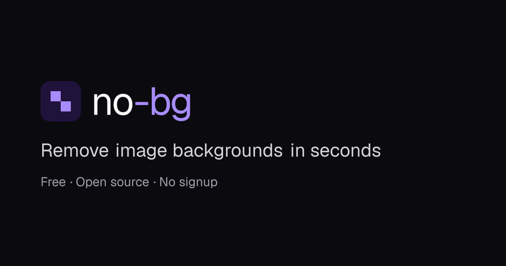

<div align="center">



# no-bg

**Free, open-source background removal. Your images never leave your server.**

[](https://github.com/davidebriscese/no-bg/actions/workflows/ci.yml)
[](https://github.com/davidebriscese/no-bg/actions/workflows/release.yml)
[](LICENSE)
[](https://github.com/davidebriscese/no-bg/pkgs/container/no-bg)
[](https://github.com/davidebriscese/no-bg/stargazers)

</div>

Upload a photo, get a transparent PNG. No account, no credits, no watermark — and no image is ever
written to disk. There is a web page for people and a plain HTTP API for programs, and both come in
one container you can run yourself.

- **Actually free.** No sign-up, no quota to buy. Fair-use rate limits, and you can lift them on
  your own instance.
- **Actually private.** Images are decoded, processed and discarded inside a single request. Nothing
  is stored, logged or used for training.
- **One container.** The web page and the API are the same process on the same origin.
- **Runs on CPU.** No GPU required; roughly a second or two per image on a modern core.

---

## Quickstart

```bash
docker run -p 8080:8080 -v no-bg-models:/app/Models ghcr.io/davidebriscese/no-bg
```

Open <http://localhost:8080>. On first start it downloads the neural network (~170MB) into the
volume, so later restarts are instant.

Or with Compose:

```bash
curl -O https://raw.githubusercontent.com/davidebriscese/no-bg/main/docker-compose.yml && docker compose up -d
```

## The web app

Drop an image, click to pick one, or paste with `Ctrl+V`. You get a before/after slider, an optional
solid background colour (composited in your browser, so it costs no extra request), and a download
button. English is at `/`, Italian at `/it`.

## The API

One endpoint. Send an image, get a transparent PNG.

```bash
curl -F "file=@photo.jpg" http://localhost:8080/api/v1/remove -o no-bg.png
```

```python
import requests

with open("photo.jpg", "rb") as photo:
    response = requests.post("http://localhost:8080/api/v1/remove", files={"file": photo})
response.raise_for_status()
open("no-bg.png", "wb").write(response.content)
```

```javascript
const body = new FormData();
body.append("file", file);

const response = await fetch("http://localhost:8080/api/v1/remove", { method: "POST", body });
if (!response.ok) throw new Error((await response.json()).code);
const png = await response.blob();
```

### `POST /api/v1/remove`

`multipart/form-data` with one part named `file`. Returns `image/png` at the original dimensions,
with the background made transparent. Up to 15MB and 25 megapixels; JPEG, PNG, WebP, BMP, GIF and
TIFF are accepted.

Failures answer JSON: `{"code": "…", "error": "…"}`. Branch on `code`, show `error` to nobody but
yourself — it is always English.

| Status | `code` | Meaning |
| --- | --- | --- |
| 400 | `missing_file` | No `file` part, or it was empty |
| 400 | `invalid_image` | The bytes are not a decodable image |
| 413 | `file_too_large` | Larger than the configured upload limit |
| 415 | `unsupported_media_type` | The part is not an `image/*` type |
| 422 | `too_many_pixels` | Above the configured pixel cap |
| 429 | `rate_limited` | Per-minute limit; see `Retry-After` |
| 429 | `daily_limit_reached` | Daily fair-use cap; see `Retry-After` |
| 503 | `server_busy` | Inference queue full; see `Retry-After` |
| 500 | `internal_error` | Something broke — please open an issue |

**Fair use.** A public instance allows 10 requests per minute and 100 per day, per IP address. No key
is needed, and none is offered: if you need more, run your own instance — that is the whole point.

Other endpoints: `GET /healthz` reports the loaded model and version, and `GET /openapi/v1.json`
is the machine-readable spec.

## Self-hosting

Every setting is an environment variable. The `NoBg__` prefix mirrors the JSON structure in
[`backend/appsettings.json`](backend/appsettings.json).

| Variable | Default | What it does |
| --- | --- | --- |
| `NoBg__RateLimit__PermitLimit` | `10` | Requests per window, per IP |
| `NoBg__RateLimit__WindowSeconds` | `60` | Length of that window |
| `NoBg__RateLimit__DailyLimit` | `100` | Requests per 24h, per IP. `0` disables the daily cap |
| `NoBg__MaxUploadBytes` | `15728640` | Upload size limit |
| `NoBg__MaxImagePixels` | `25000000` | Pixel cap, to stop decompression bombs |
| `NoBg__MaxConcurrentInferences` | `2` | Images processed at once; raise it with core count |
| `NoBg__InferenceQueueTimeoutSeconds` | `10` | How long a request waits for a slot before a 503 |
| `NoBg__RequestTimeoutSeconds` | `60` | Wall-clock budget per request; raise it on slow hardware |
| `NoBg__AllowedOrigins__0` | *(unset)* | Lock CORS to specific origins. Unset means any origin |
| `NoBg__Model__Name` | `isnet-general-use` | Model file name, without `.onnx` |
| `NoBg__Model__Url` | *(see appsettings)* | Where to fetch it on first start |
| `NoBg__Model__Sha256` | *(see appsettings)* | Expected checksum. Empty string disables the check |
| `NoBg__Model__InputSize` | `1024` | Square input resolution the model expects |
| `ASPNETCORE_URLS` | `http://+:8080` | Listen address |
| `ASPNETCORE_FORWARDEDHEADERS_ENABLED` | *(unset)* | See below |

**Behind a reverse proxy**, set `ASPNETCORE_FORWARDEDHEADERS_ENABLED=true` so rate limits key on the
real client IP instead of the proxy's. Only do this when the container is reachable *exclusively*
through a proxy that overwrites `X-Forwarded-For` itself — otherwise anyone can forge the header and
walk around the limits.

**Bind mounts** for `/app/Models` need to be writable by the container user: `chown 1654 <dir>`.
Named volumes inherit the right ownership from the image and need nothing.

Rate-limit counters live in memory: they reset when the container restarts, and the daily window
starts at a client's first request rather than at midnight. That is fair-use behaviour, not billing.

## Models and their licences

The model is downloaded at runtime, not baked into the image, so swapping it is a config change.

| Model | Licence | Notes |
| --- | --- | --- |
| [`isnet-general-use`](https://github.com/danielgatis/rembg/releases/download/v0.0.0/isnet-general-use.onnx) | Apache-2.0 | Default. Best all-round quality |
| [`u2net`](https://github.com/danielgatis/rembg/releases/download/v0.0.0/u2net.onnx) | Apache-2.0 | Older, lighter, rougher edges |
| [`u2netp`](https://github.com/danielgatis/rembg/releases/download/v0.0.0/u2netp.onnx) | Apache-2.0 | Smallest and fastest |
| [`silueta`](https://github.com/danielgatis/rembg/releases/download/v0.0.0/silueta.onnx) | Apache-2.0 | u2net-sized quality in a smaller file |
| `BRIA RMBG-1.4` | **CC BY-NC 4.0** | ⚠️ Non-commercial only. Do not use it on a public or commercial instance |

To switch, point `NoBg__Model__Url` and `NoBg__Model__Name` at another file and set
`NoBg__Model__InputSize`, `NoBg__Model__Mean` and `NoBg__Model__Std` to the values that model was
trained with — [rembg's session definitions](https://github.com/danielgatis/rembg) are the reference.
Clear `NoBg__Model__Sha256` (or set the new file's checksum) or startup will reject the download.

## How it works

```
browser ──► Kestrel ──┬──► static export (wwwroot)   the page, one HTML file per locale
                      └──► /api/v1/remove
                              │
                              ├─ header-only decode: reject bombs before allocating
                              ├─ resize to the model input, normalise, run ONNX Runtime
                              └─ min-max the saliency map into the alpha channel, encode PNG
```

The frontend is a Next.js static export; the backend is an ASP.NET Core minimal API that serves
those files and runs the model through ONNX Runtime on CPU. Comparing, recolouring and downloading
all happen client-side, so the server only ever does the one expensive thing.

## Development

You need the .NET 10 SDK and Node.js 22+. See [CONTRIBUTING.md](CONTRIBUTING.md) for the full loop;
the short version is two terminals:

```bash
dotnet run --project backend
```

```bash
npm install --prefix frontend && npm run dev --prefix frontend
```

Adding a language is one dictionary file and one registry entry — TypeScript reports anything you
miss, and the backend picks up the new page on its own.

## Licences

no-bg is MIT licensed. Its dependencies:

- **ONNX Runtime** — MIT.
- **SixLabors.ImageSharp 3.1.x** — Six Labors Split License 1.0, which grants Apache-2.0 terms when
  the consuming software is open source. no-bg qualifies, and the dependency is pinned to 3.1.x
  deliberately: later versions changed those terms.
- **Model weights** — see the table above. The default is Apache-2.0.

Demo photos in `frontend/public/samples/` are from Unsplash under the
[Unsplash License](https://unsplash.com/license), by
[Jurica Koletić](https://unsplash.com/@juricakoletic),
[USAMA AKRAM](https://unsplash.com/@usama_1248) and
[Richard Brutyo](https://unsplash.com/@richardbrutyo).

## Contributing

Issues, translations and focused pull requests are welcome — start with
[CONTRIBUTING.md](CONTRIBUTING.md). For security reports, see [SECURITY.md](SECURITY.md).
